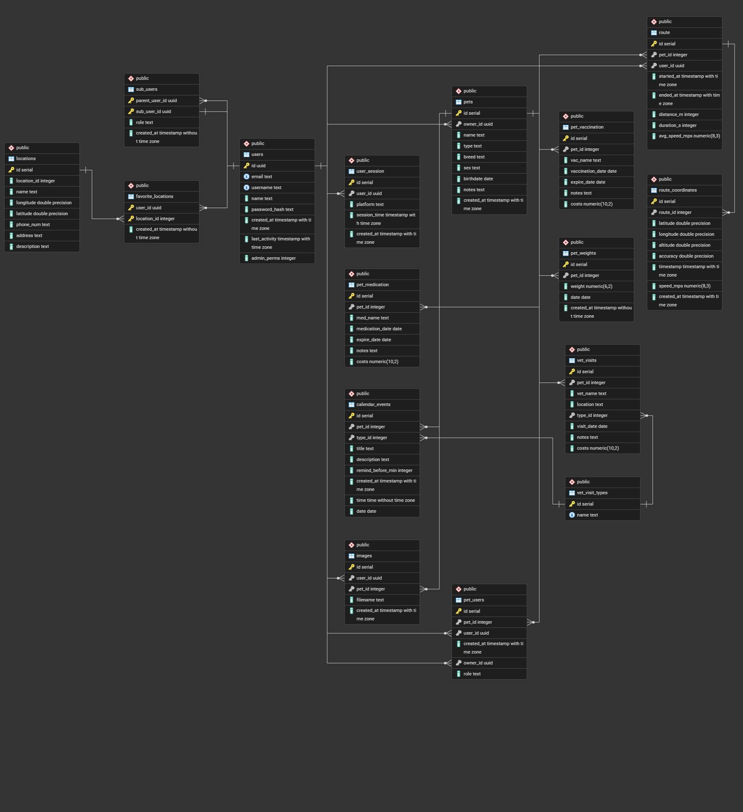

# MyPet - Mobile app project (Group 5)

### Overview

MyPet is a comprehensive React Native mobile application designed for pet owners to manage and track all aspects of their pets' care and wellbeing. Built with TypeScript and Expo, it provides a centralized platform for organizing pet information, health records, activities, and daily care routines.

### What is MyPet?

MyPet is an all-in-one pet care companion that helps pet owners:

- Organize pet profiles with detailed information about each animal
- Track health records including vaccinations, medications, and veterinary visits
- Monitor pet activities through GPS-based walk tracking with real-time statistics
- Manage weight with historical data and visual progress charts
- Schedule events using an integrated calendar for reminders and appointments
- Share access with family members through sub-user accounts

### Key use cases

1. **Health Management**
    - Record and track vaccinations with expiration dates.
    - Manage ongoing medications with start and end dates.
    - Document veterinary visits with location, costs and notes.
    - Monitor pet weight changes over time with a graphical visualization.

2. **Activity tracking**
    - Record walks with GPS tracking and route mapping.
    - Track distance, duration, speed and step count.
    - View walk history with detailed statistics.
    - Sync walk data to cloud storage (optional)

3. **Organization & Planning**
    - Create calendar events for appointments, grooming and other activities.
    - Manage multiple pets from a single account.
    - Access pet information across devices.

4. **Multi user collaboration**
    - Share pet information to friends, family, veterinarian or a caretaker.
    - Assign roles with different permission levels.
    
## Tech Stack

### **Frontend**
 - **React Native** with **Expo** for cross-platform mobile development (iOS & Android).
 - **TypeScript** for type safety.
 - **React Native Paper** implementing Material Design 3.
 - **Expo Location** & **OSM (Open Street Map)** for GPS tracking and mapping.

### **Backend**
 - **Backend Framework**: Express.js (Node.js).
 - **Database**: PostgreSQL.
 - **Authentication**: JWT (JSON Web Tokens) with bcrypt password hashing.
 - **Security**: Helmet for security headers, CORS protection, rate limiting for API abuse prevention.
 - **Deployment**: Docker containerization support.
 - **API Design**: RESTful architecture designed for mobile app consumption.

### Database Schema

The application uses PostgreSQL with the following Entity Relationship Diagram (ERD):



The database schema includes tables for users, pets, health records (vaccinations, medications, vet visits), weight tracking, calendar events, and walk routes. The schema supports multi-user collaboration through role-based access control.

### Data Storage
 - **AsyncStorage** for local data persistence.
 - Cloud sync capabilities for walk routes.

### Backend Integration
 - RESTful API communication via Axios.
 - Services for pets health records, walks & calendar events.

### Key features
- Secure user registration & login.
- Protected API endpoints with token-based authentication.
- Data validation and sanitization.
- Rate limiting to prevent brute force attacks.
- Mobile-friendly API response structure

## Design Philosophy

The application follows **Material Design 3** principles, providing:

- Clean, modern interface with consistent styling 
- Intuitive navigation with tab and stack navigators
- Accessible color scheme with proper contrast ratios
- Responsive layouts that work across different screen sizes
- Smooth animations and transitions for better UX

## Repository structures

### Backend

```
pet-app-backend/
├── .github/                          # GitHub workflows and configurations
├── .gitignore                        # Git ignore rules
├── LICENSE                           # Project license
├── database.sql                      # PostgreSQL database schema
├── package-lock.json                 # Root dependency lock file
│
└── backend/                          # Main backend application
    ├── .env.example                  # Environment variables template
    ├── .gitignore                    # Backend-specific ignore rules
    ├── docker-compose.ci.yml         # Docker Compose for CI/CD
    ├── DockerFile                    # Docker container configuration
    ├── package.json                  # NPM dependencies and scripts
    ├── package-lock.json             # Dependency lock file
    ├── README.md                     # Backend documentation
    │
    └── src/                          # Source code
        ├── index.js                  # Application entry point
        │
        ├── config/                   # Configuration files
        │   ├── database.js              # PostgreSQL connection pool
        │   └── jwt.js                   # JWT configuration
        │
        ├── controllers/              # Request handlers (business logic)
        │   ├── authController.js        # Authentication (login, register)
        │   ├── calendarEventController.js  # Calendar event management
        │   ├── medicationController.js  # Medication tracking
        │   ├── petController.js         # Pet profile management
        │   ├── routeController.js       # Route tracking
        │   ├── vaccinationController.js # Vaccination records
        │   ├── vetVisitController.js    # Vet visit tracking
        │   └── weightController.js      # Weight monitoring
        │
        ├── middleware/               # Express middleware
        │   ├── authenticateToken.js     # JWT authentication middleware
        │   ├── resolveEffectiveUser.js  # User resolution logic
        │   ├── validateLogin.js         # Login validation
        │   ├── validateRegistration.js  # Registration validation
        │   ├── validateSubUserRegistration.js  # Sub-user registration validation
        │   └── validateSubUserRoleUpdate.js    # Role update validation
        │
        ├── models/                   # Database models (Data access layer)
        │   ├── CalendarEvent.js         # Calendar event model
        │   ├── Medication.js            # Medication model
        │   ├── Pet.js                   # Pet model
        │   ├── Route.js                 # Route model
        │   ├── User.js                  # User model
        │   ├── Vaccination.js           # Vaccination model
        │   ├── VetVisit.js              # Vet visit model
        │   └── Weight.js                # Weight model
        │
        ├── routes/                   # API route definitions
        │   ├── calendarEventRoutes.js   # /api/calendar-events endpoints
        │   ├── medicationRoutes.js      # /api/medications endpoints
        │   ├── petRoutes.js             # /api/pets endpoints
        │   ├── routeRoutes.js           # /api/routes endpoints
        │   ├── userRoutes.js            # /api/auth & /api/users endpoints
        │   ├── vaccinationRoutes.js     # /api/vaccinations endpoints
        │   ├── vetVisitRoutes.js        # /api/vet-visits endpoints
        │   └── weightRoutes.js          # /api/weights endpoints
        │
        ├── services/                 # Business logic services (future)
        │
        ├── types/                    # Type definitions (future)
        │
        └── utils/                    # Utility functions
            ├── generateToken.js         # JWT token generation
            ├── hashPassword.js          # Password hashing with bcrypt
            └── shareCode.js             # Share code generation
```

### Application

```
application/
│
├── mobile/                          # React Native mobile application
│   ├── src/
│   │   ├── components/              # Reusable UI components
│   │   │   ├── AddPetDialog.tsx     # Modal for adding new pets
│   │   │   ├── PetCard.tsx          # Pet display card component
│   │   │   └── ...
│   │   │
│   │   ├── contexts/                # React Context providers for state management
│   │   │   ├── AuthContext.tsx      # Authentication state & user management
│   │   │   ├── WalkContext.tsx      # Walk tracking, GPS, pedometer, sync
│   │   │   └── SnackbarContext.tsx  # Toast notifications
│   │   │
│   │   ├── helpers/                 # Utility functions
│   │   │   └── index.ts             # Date formatting, age calculation, validation
│   │   │
│   │   ├── navigation/              # Navigation configuration
│   │   │   └── Navigation.tsx       # Stack & tab navigators setup
│   │   │
│   │   ├── screens/                 # Application screens
│   │   │   ├── PetsScreen.tsx       # Pet list view
│   │   │   ├── PetProfileScreen.tsx # Individual pet details & management
│   │   │   ├── MapScreen.tsx        # GPS walk tracking with OpenStreetMap
│   │   │   ├── CalendarScreen.tsx   # Event scheduling & reminders
│   │   │   ├── ProfileScreen.tsx    # User account management
│   │   │   ├── LoginScreen.tsx      # Authentication
│   │   │   ├── RegisterScreen.tsx   # User registration
│   │   │   ├── VaccinationsScreen.tsx        # Vaccination records
│   │   │   ├── MedicationsScreen.tsx         # Medication tracking
│   │   │   ├── VetVisitsScreen.tsx           # Veterinary visit history
│   │   │   ├── WeightManagementScreen.tsx    # Weight tracking & charts
│   │   │   └── ...
│   │   │
│   │   ├── services/                # API & data management
│   │   │   ├── api.ts               # Axios configuration & interceptors
│   │   │   ├── petService.ts        # Pet CRUD operations
│   │   │   ├── authService.ts       # Authentication API calls
│   │   │   ├── routeService.ts      # Walk route sync with backend
│   │   │   ├── storageService.ts    # AsyncStorage wrapper
│   │   │   ├── calendarService.ts   # Calendar event management
│   │   │   └── ...
│   │   │
│   │   ├── styles/                  # Styling & theming
│   │   │   ├── theme.ts             # Material Design 3 theme configuration
│   │   │   ├── screenStyles.ts      # Screen-specific styles
│   │   │   └── ...
│   │   │
│   │   ├── types/                   # TypeScript type definitions
│   │   │   └── index.ts             # Interfaces for Pet, User, Walk, etc.
│   │   │
│   │   └── App.tsx                  # Root application component
│   │
│   ├── assets/                      # Static resources
│   │   ├── images/                  # Image files
│   │   └── fonts/                   # Custom fonts
│   │
│   ├── app.json                     # Expo configuration
│   ├── package.json                 # Dependencies & scripts
│   ├── tsconfig.json                # TypeScript configuration
│   └── README.md                    # Mobile app documentation
│
├── backend/                         # Backend API server (if applicable)
│   ├── controllers/                 # Request handlers
│   ├── models/                      # Database models
│   ├── routes/                      # API endpoints
│   ├── middleware/                  # Authentication, validation, etc.
│   └── ...
│
└── README.md                        # Main project documentation
```

### Documents

```
Documents/
├── images/            # Documentation images
├── ProjectDocs        # Other documentation files
└── README.md          # This file
```

